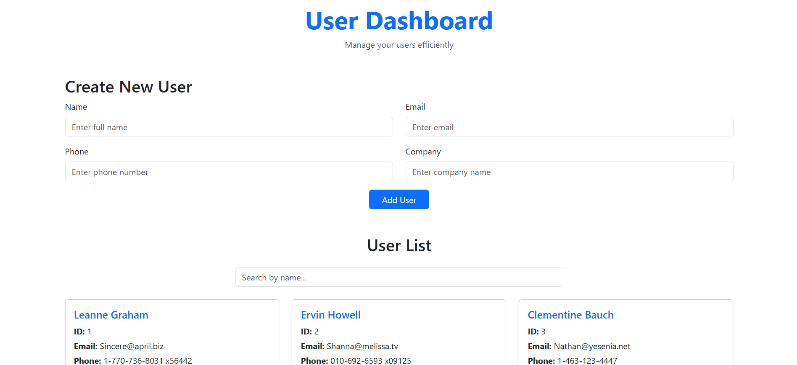
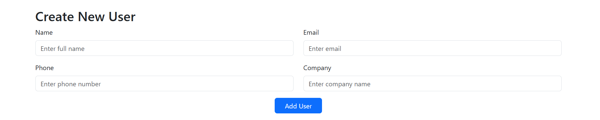
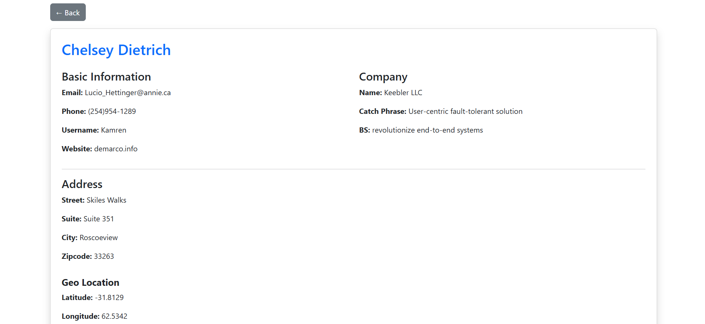

# React User Dashboard

A simple **React.js User Dashboard** project that demonstrates:

Fetching Users from an API
Adding new users using a form
Global state using React Context
Bootstrap UI components
Search / Filter users
User Detail page
Navigation using React Router

---

## 🚀 Features

### ✅ Dashboard
- Responsive **Responsive card Layout**
- Search / filter users by name
- click card to view user details

### ✅ Add New User
- Clean Bootstrap form
- Store users globally using **React Context**

### ✅ User Details Page
Includes:
- Full user information (name, email, phone, website)
- Company details
- Address
- Geo-location (lat & lng)
- Back button using `useNavigate`

### ✅ Navigation
- `/` - Dashboard
- `/user/:id` - Users Details Page

---

## 🛠️ Technologies Used

- React.js
- React Router v6
- Context API
- Bootstrap 5

---

## 📸 Screenshots

### Dashboard


### Add User


### User Details


---

## 📦 Installation

### 1️⃣ Clone the repository
```bash
git clone https://github.com/Asad3046/user-dashboard-react.git
cd user-dashboard-react 
```

### 2️⃣ Install dependencies
```bash
npm install
```

### 3️⃣ Run the development server
```bash
npm start
```

### Visit
```bash
http://localhost:3000
```

---

## 📁 Project Structure
- src/
    - components/
        - Dashboard.jsx
    - contexs/
        - UserContext.jsx
    - pages/
        - CreateUser.jsx
        - UserDetails.jsx
        - UserTable.jsx
    - App.js
    - index.js

---

## Routing
```jsx
<Route>
    <Route path="/" element={<Dashboard />} />
    <Route path="/user/:id" element={<UserDetails />} />
</Route>
```

---

## 🔮 Future Work
- Add edit user functionality
- Add delete user functionality
- Integrate real backend API
- Add authentication (login/logout)
- Improve UI with animations
- Add export options (PDF)

---

## 🤝 Contributing
Pull requests are welcome!
If you'd like to improve the UI or functionality, feel free to fork the repo.

---

## ⭐ If you Like this project
Give it a star on GitHub! ⭐


